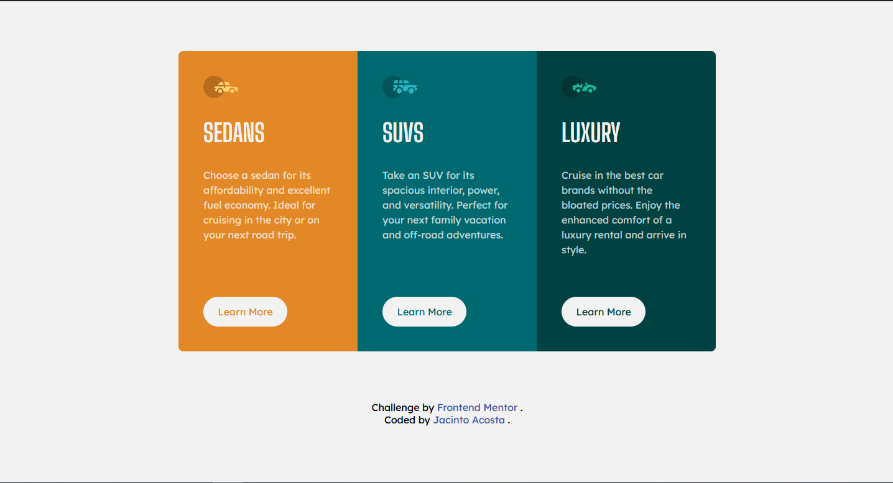

# Frontend Mentor - 3-column preview card component solution

This is a solution to the [3-column preview card component challenge on Frontend Mentor](https://www.frontendmentor.io/challenges/3column-preview-card-component-pH92eAR2-). Frontend Mentor challenges help you improve your coding skills by building realistic projects.

## Table of contents

- [Overview](#overview)
  - [The challenge](#the-challenge)
  - [Screenshot](#screenshot)
  - [Links](#links)
- [My process](#my-process)
  - [Built with](#built-with)
  - [What I learned](#what-i-learned)
- [Author](#author)

## Overview

### The challenge

Users should be able to:

- View the optimal layout depending on their device's screen size
- See hover states for interactive elements

### Screenshot

### Links

- Solution URL: [Here!](https://github.com/jacintoaczz/3-column-preview-card)
- Live Site URL: [Here!](https://your-live-site-url.com)

## My process

### Built with

- Semantic HTML5 markup
- CSS custom properties
- Flexbox
- CSS Grid
- Mobile-first workflow

### What I learned

I used this challenge to practice the _:nth-child_ pseudo-selector usage and it's applicability. Thought it would be fun to use it on the cards since it would allow me to avoid creating classes for each one and improve the readbility of the code a bit.

## Author

- Frontend Mentor - [@jacintoaczz](https://www.frontendmentor.io/profile/jacintoaczz)
- Twitter - [@jacintoaczz](https://www.twitter.com/jacintoaczz)
